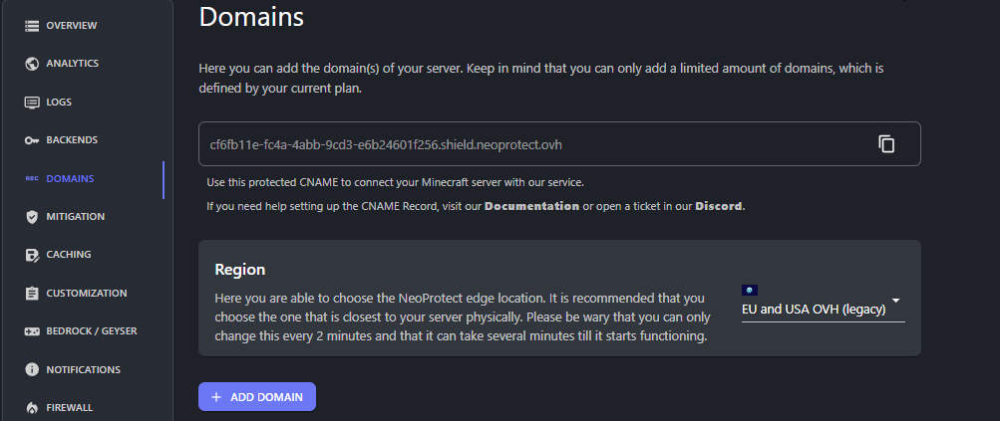

---
authors:
  - ...
---

# Подключение NeoProtect к серверу

NeoProtect - прокси сервис, защищающий сервер от DDoS атак

Бесплатный тариф подходит для серверов с онлайном меньше 30 человек. О нём и пойдёт речь.

## Возможности бесплатного тарифа

- 1 ТБ Трафика в месяц
- 2 Домена
- 2 Точки присутствия

::: warning :warning: Обратите внимание
**Обязательно нужен купленный домен!**
:::

## Шаг 1

Что бы начать работать, нужно зайти на сайт [neoprotect.net](https://neoprotect.net/) и зарегистрироваться

## Шаг 2

После того как вы зарегистрируетесь и окажетесь на [panel.neoprotect.net](https://panel.neoprotect.net/), нажмите на "+" и выберите тарифный план. 
Затем введите IP своего сервера, выберите локацию и добавьте свой домен.

## Шаг 3

Добавляем CNAME запись в DNS. Можно скопировать во вкладке domains в настройках сети.

## Шаг 4

Радуемся что ваш сервер защищен!

:::
